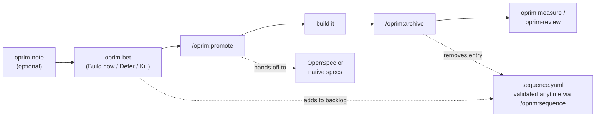

# Open Product Primer

Every developer hits the same moment: you're about to build something and haven't written down why — what problem it solves, why now, and what would make you stop. **`oprim`** gives that decision a home in your repo.

Install `oprim`, run `oprim init` to set up your workspace, then use `oprim-bet` in your AI coding agent to capture your first decision. That's the core loop.

## What it does

oprim stores the decisions that precede implementation — why you're building something, in what order, and whether it worked. It always answers **why / order / outcomes**, and can optionally also own **what / how** for each change, either alongside your implementation planning tool (OpenSpec) or on its own via native specs — plus a traceability layer (Graphify) if you use one:

| Layer | Tool | Artifacts |
|-------|------|-----------|
| Decision & sequencing | oprim | `oprim/` |
| Implementation planning | OpenSpec (`opsx`), or oprim's own native specs | `openspec/changes/`, or `oprim/specs/` |
| Semantic traceability | Graphify | `graphify-out/` |

Pick a spec framework at `oprim init` time (`openspec`, `native`, or `none`) — see [Native specs](#native-specs) below.

## The workflow



1. **Capture** an idea as a note (optional), or go straight to a **bet** — a committed decision with a why, alternatives, expected outcome, kill criterion, and a Build now/Defer/Kill call
2. Every bet lands in the sequencing board's backlog automatically; `/oprim:sequence` validates and rebalances the Now/Next/Later board at any point, not just here — run it whenever the board needs a health check
3. **Promote** (`/oprim:promote BET-XXX`) hands the bet to OpenSpec or native specs for the what/how — define success first with `oprim-criteria`
4. Build against that spec
5. **Archive** (`/oprim:archive BET-XXX`) folds any spec delta into current truth, closes the bet out, and removes it from the board
6. **Measure and review** (`oprim measure`, `oprim-review`) compare outcomes against the criteria set in step 3

See [`WORKFLOW.md`](WORKFLOW.md) for the full walkthrough of each stage, what artifact it produces, and what happens if you skip it.

## Installation

```bash
npm install -g @open-product-primer/cli@latest
```

## Quick start

```bash
cd your-project
oprim init    # scaffold oprim/ workspace
oprim doctor  # verify setup
oprim update  # install /oprim:* assistant commands
```

## CLI reference

### `oprim init`

Creates the project-local `oprim/` workspace. Idempotent — safe to re-run; existing decision artifacts and config values are preserved. Existing repos with `primer/` should run `oprim migrate` first.

Prompts interactively for: [OKF](https://github.com/GoogleCloudPlatform/okf) (Open Knowledge Format) frontmatter — whether scaffolded artifacts get `oprim`-schema YAML frontmatter, so other tools can parse them as structured metadata instead of plain prose — a spec framework (`openspec`, `native`, or `none`), and which AI agents to install skills for (`claude`, `cursor`, `codex`, `gemini`, `poolside` — repeatable via `--agent`, or `--name <project-name>` to override the default directory-name project name).

**Creates:**

```
oprim/
├── config.yaml           # project config, integration flags, spec framework, rules
├── sequence.yaml         # Now/Next/Later board
├── decisions/            # PDR artifacts
├── bets/                 # bet decision artifacts
├── reviews/               # KPI review artifacts
├── notes/                 # lightweight capture artifacts (precede a bet)
├── scripts/
│   └── generate-sequence-view.js
└── templates/             # ready-to-use templates
    ├── pdr.md
    ├── bet-decision.md
    ├── criteria.yaml
    ├── kpi-review.md
    ├── discovery.md
    └── note.md
```

Detects OpenSpec (`openspec/`) and Graphify (`graphify-out/`) and enables integration flags in `oprim/config.yaml` without requiring those tools to be present.

`oprim/config.yaml` also carries a free-text `context:` block (language, tech stack, project conventions), per-artifact `rules:` (`bet`/`pdr`/`spec`/`review` — custom instructions folded into bet/PDR/spec/review generation prompts when set), and a `remote_context:` block (`enabled`, `sources: []`) for citing other projects' oprim workspaces — see `oprim context` below. All default to empty/inert and don't change generation behavior until set.

### `oprim update`

Refreshes `/oprim:*` assistant commands for detected AI tools (Claude Code, Cursor, Codex, Gemini, Poolside). Also additively merges any `oprim/config.yaml` schema keys introduced since the project was last updated — adding missing keys with their defaults, never touching values you've already set.

### `oprim doctor`

Reports pass/fail status for:

- oprim/ scaffold and config
- OpenSpec and Graphify integrations (optional)
- measurement environment variables (`AMPLITUDE_API_KEY`, `GOOGLE_APPLICATION_CREDENTIALS`)
- bets missing `discovery.md`
- sequencing-board integrity (WIP limit overruns, dangling `blocked_by`/`unlocks` references)
- installed Claude skills that have drifted from the bundled versions (run `oprim update` to refresh)
- registered `remote_context` sources (reachable, identity resolves, name matches)
- installed assistant commands and hooks

### `oprim migrate`

Renames a legacy `primer/` directory to `oprim/` in place. Run this once before `oprim init` if the project predates the `oprim` rename; a no-op if `oprim/` already exists.

### `oprim measure <bet-id>`

Generates and runs KPI measurements for a bet from its `criteria.yaml`: writes Amplitude event definitions and BigQuery SQL to `oprim/bets/pending/BET-XXX/measurements/`, then executes them (requires `AMPLITUDE_API_KEY` / `GOOGLE_APPLICATION_CREDENTIALS` as applicable) and records a dated run result. Use `--dry-run` to generate the definition files without calling either API.

### `oprim ovw`

Prints the sequencing board (`now`/`next`/`later`/`backlog`) with each `now`/`next` bet annotated inline with its door type (1-way/2-way) and risk profile (value/usability/feasibility/viability), read from `bet-decision.md`. Follows with an advisory section flagging things like an empty or overloaded `now` lane, a 1-way door bet with no 2-way door "unrisker" in flight, doors sequenced in the wrong order, or elevated risk without a mitigation plan.

### `oprim context`

Manage citable connections between oprim workspaces across repositories:

| Subcommand | Description |
|---|---|
| `oprim context init [--description <text>]` | Declare the current project as a citable remote context — writes `.oprim-context/context.yaml` |
| `oprim context register --name <name> (--git <url> \| --local <path>) [--description <text>]` | Register another project's context as a source in this project's `oprim/config.yaml` |
| `oprim context list` | List registered sources with their canonical identity/description, without pulling full content |
| `oprim context [--source <name>]` | Print the fully resolved `oprim/` workspace content of every registered source (or just one) |

Git sources are cloned into a throttled local cache (`~/.oprim/remote-context-cache/`); local-path sources are always read live. `oprim doctor` validates that every registered source still resolves.

## Key concepts

### Product Decision Records (PDRs)

Durable product policy decisions stored at `oprim/decisions/PDR-XXX-name.md`. Separate from bet prioritization decisions so policy is never duplicated across initiative artifacts.

### Bet decisions

Say you're deciding whether to rewrite a legacy service, cut a feature that isn't landing, or invest in a new capability. Before you build, you write a *bet*: what's the problem, why tackle it now, and what outcome would tell you it worked. That artifact lives at `oprim/bets/pending/BET-XXX/bet-decision.md` and links to relevant policy decisions (PDRs) so you're not restating policy each time. A bet's directory sits under `oprim/bets/pending/` while active and moves to `oprim/bets/archived/` once folded into current truth — an at-a-glance built-vs-in-flight signal with no file inspection required.

### Sequencing board

`oprim/sequence.yaml` — structured Now/Next/Later board with `blocked_by`, `unlocks`, `requires_pdrs`, and WIP limits. Use `/oprim:sequence` to validate the board state.

### Criteria contracts

`oprim/bets/pending/BET-XXX/criteria.yaml` — metric definitions with baseline, target, timeframe, and data source. Imported from Notion at bet promotion time and linked forward to OpenSpec changes.

### KPI reviews

`oprim/reviews/YYYY-MM-DD-BET-XXX-kpi.md` — post-launch metric comparison and decision-quality reflection. Outcomes feed back into bet decisions, PDRs, and sequencing.

### Notes

`oprim/notes/` — lightweight, low-friction capture for an idea before it's worth writing up as a full bet. Promote a note into a bet once it's worth prioritizing.

### Native specs

An opt-in alternative (or complement) to OpenSpec, chosen at `oprim init` time (`integrations.spec_framework: native`). Current truth for a capability lives at `oprim/specs/<capability>/spec.md`, written in Gherkin; an in-flight bet's proposed ADDED/MODIFIED/REMOVED delta lives at `oprim/bets/pending/BET-XXX/specs/<capability>/spec.md` until `/oprim:archive` folds it into current truth. The first `oprim-spec` pass for a bet also scaffolds `design.md` (technical approach) and `tasks.md` (a flat, checkbox implementation list matching OpenSpec's own convention) alongside the spec delta; later passes for the same bet only touch the spec delta. A `tasks.md` with unchecked items makes `/oprim:archive` warn before archiving, so implementation completeness is visible without asking.

### Remote context

Lets one project cite another project's `oprim/` workspace as read-only context — for example, a service repo citing a platform repo's PDRs. The cited project runs `oprim context init` once to become citable; the citing project runs `oprim context register` to add it as a source. See `oprim context` above.

## Agent commands

Install with `oprim update`, then use in Claude Code, Cursor, Codex, Gemini, or Poolside:

| Command | Description |
|---------|-------------|
| `/oprim:promote BET-XXX` | Promote a prioritized bet to an OpenSpec (or native spec) change with criteria linking |
| `/oprim:sequence` | Validate the sequencing board and suggest rebalancing |
| `/oprim:archive` | Archive a completed bet — move it out of the active board |
| `/oprim:context-init` | Guided Q&A to declare the current project a citable remote context |
| `oprim-bet` | Create a new bet directory and bet-decision artifact, added to the sequencing backlog |
| `oprim-pdr` | Create a new Product Decision Record with an auto-assigned ID |
| `oprim-note` | Capture a lightweight note ahead of a full bet |
| `oprim-criteria` | Create or append to a bet's `criteria.yaml` metric contract |
| `oprim-review` | Create a KPI review artifact for a completed bet, pre-filled from `criteria.yaml` |

## Authority boundaries

Open Product Primer owns **why / order / outcomes**.
**What / how** for each change is owned by OpenSpec, or by oprim's own native specs if that framework is selected — never both.

Primer artifacts never duplicate implementation requirements.
Spec artifacts (OpenSpec or native) never duplicate prioritization rationale.
The link between the layers is the promotion contract (`/oprim:promote`).

## npm package

Package: `@open-product-primer/cli`
Bin aliases: `oprim`, `open-product-primer`
Source: `packages/cli/`

Releases are published via GitHub Actions on `v*` tags using [npm trusted publishing](https://docs.npmjs.com/trusted-publishers/) (see `.github/workflows/release.yml`).
