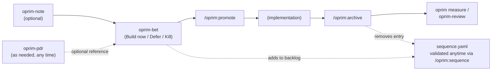

# The oprim workflow

This is the full lifecycle of a decision as it moves through `oprim`, from a raw idea to a measured outcome. The README covers the short version — this document walks through each stage, what artifact it produces, and what happens if you skip it.

Every stage below is optional except **bet** — it's the smallest unit oprim tracks. Two pieces sit outside the pipeline entirely rather than at a fixed step: the sequencing board (every bet lands in its `backlog` the moment it's created; `/oprim:sequence` validates and rebalances on demand, not at one fixed point) and PDRs (`oprim-pdr`, written whenever a policy question comes up, independent of any single bet). Both are covered in their own section below rather than a numbered step.

## 1. Capture the idea — `oprim-note` (optional)

Not every idea deserves a bet yet. `oprim-note` writes a lightweight, low-friction artifact to `oprim/notes/NOTE-XXX-<slug>.md` — just enough to not lose the thought. Notes don't touch the sequencing board and don't need a decision yet.

Promote a note into a bet later with `/oprim:promote NOTE-XXX` once it's worth prioritizing. This pre-fills the bet's `## Why now` from the note body but deliberately leaves `Alternatives considered`, `Expected outcomes`, and `Kill criteria` blank — those require a real decision, not a note.

## 2. Commit to the decision — `oprim-bet`

A bet is a commitment to explore a problem, hypothesis, or direction. Running `oprim-bet` (or promoting a note) does the following:

1. Prompts for a title, validating it's specific enough to scan at a glance ("Improve bet naming for scannability", not "Naming")
2. Assigns the next `BET-NNN` ID by scanning both `oprim/bets/pending/` and `oprim/bets/archived/`
3. Derives a URL-safe slug from the title
4. Asks the "when to build" question directly — a decision of `Build now` / `Defer` / `Kill` — alongside door type (1-way/2-way) and a Value/Usability/Feasibility/Viability risk rating
5. Writes `oprim/bets/pending/BET-NNN-<slug>/bet-decision.md` — problem, why now, alternatives considered, expected outcomes, kill criteria, and that decision
6. Registers the bet in `oprim/sequence.yaml`'s `backlog` lane — every new bet starts here regardless of its decision

A bet can link to relevant PDRs instead of restating policy, and can list one or more `## Capabilities` it will touch — used later by `/oprim:promote` to know which spec files to create.

## Used as needed, not tied to a pipeline stage

Two pieces of oprim sit outside the linear flow above. Neither belongs to a specific step — both get reached for whenever they're relevant, independent of where a given bet is in its lifecycle.

**Durable policy — `oprim-pdr`.** A Product Decision Record borrows its shape directly from the [Architecture Decision Record](https://adr.github.io/) pattern (Michael Nygard's "Documenting Architecture Decisions," 2011) — the same "context, decision, consequences" structure that's durable, immutable once accepted, and lives independent of any one piece of work, just aimed at product/policy calls instead of technical ones. Where an ADR answers "why did we choose Postgres over Mongo," a PDR answers "why don't we ship features behind a paywall on mobile" — policy, not initiative-scoped. Those go in `oprim/decisions/PDR-XXX-<slug>.md` via `oprim-pdr`, written whenever a policy question comes up — before a bet exists, alongside one, or well after. A bet can *reference* a PDR it depends on (`requires_pdrs` in `sequence.yaml`, or a link in `bet-decision.md`), but, matching ADR convention, a PDR is superseded rather than edited in place and doesn't belong to any single bet or get created as part of the bet flow.

**Sequencing the board — `/oprim:sequence`.** `oprim/sequence.yaml` is a Now/Next/Later/Backlog board. A bet's `Build now` decision (step 2 above) records *intent*; it doesn't move the bet out of `backlog` — that's a separate sequencing call. Run `/oprim:sequence` whenever the board needs a health check, not on any fixed schedule relative to bet creation or promotion:

- Enforces WIP limits per lane
- Checks `blocked_by`/`unlocks` references actually resolve to real bets
- Flags a `now`/`next` bet whose required PDRs (`requires_pdrs`) don't exist yet
- Surfaces sequencing risk via `oprim ovw` — e.g., a 1-way-door bet in flight with no 2-way-door "unrisker" ahead of it, or doors sequenced in the wrong order

Moving a bet from `backlog` into `now` or `next` is itself a sequencing decision `/oprim:sequence` helps validate — you'll typically run it again after archiving a bet too, to pull the next thing forward.

## 3. Define success — `oprim-criteria` (recommended before promoting)

Before committing engineering time, write down what "worked" means: `oprim-criteria` creates or appends to `oprim/bets/pending/BET-XXX/criteria.yaml` — baseline, target, timeframe, and a data source (Amplitude event or BigQuery query). This is what `oprim measure` and `oprim-review` read from later, and what `/oprim:promote` links forward into the spec change.

Skipping this doesn't block promotion, but it means there's no automated way to check whether the bet paid off.

## 4. Hand off to implementation — `/oprim:promote BET-XXX`

This is the seam between **why/order** (oprim) and **what/how** (specs). The promotion path depends on which spec framework the project selected at `oprim init` time:

**OpenSpec** (`integrations.spec_framework: openspec`):
- Validates the bet's decision is `Build now`
- Invokes `/opsx:propose` to scaffold a full OpenSpec change — `proposal.md`, `design.md`, `tasks.md`, and `specs/<capability>/spec.md` for every capability the bet lists — never a partial directory
- Links the OpenSpec change path back into the bet's `## Links`, and the bet ID into the proposal's `## Context`
- Copies forward the `criteria.yaml` link if one exists

**Native specs** (`integrations.spec_framework: native`):
- Same validation, but invokes `oprim-spec` instead — writes `oprim/bets/pending/BET-XXX/specs/<capability>/spec.md` as an ADDED/MODIFIED/REMOVED delta against current truth, in Gherkin
- The first pass for a bet also scaffolds `design.md` and `tasks.md` next to the delta; later passes only touch the spec delta
- Nothing is written to `oprim/specs/<capability>/spec.md` (current truth) yet — that happens on archive
- No OpenSpec install required

Either way, a note promotes into a bet the same way regardless of spec framework (`/oprim:promote NOTE-XXX` — see step 1).

## 5. Build it

This is outside oprim's authority boundary by design — implementation happens against whichever spec artifact promotion produced (`openspec/changes/<name>/tasks.md` or the bet's `tasks.md` in native mode). oprim doesn't track code, only the decision and the spec contract.

## 6. Close the loop — `/oprim:archive BET-XXX`

Archiving is what makes the board and specs honest again:

1. Resolves the bet directory, checks nothing else in `sequence.yaml` still lists it in `blocked_by`/`unlocks`
2. In native mode: folds each `specs/<capability>/spec.md` delta into `oprim/specs/<capability>/spec.md` (current truth) — ADDED requirements are appended, MODIFIED requirements replace their matching header, REMOVED requirements are deleted
3. Flags **cross-bet conflicts** — if another still-active bet has a delta touching the same requirement header, archiving proceeds but the conflict is surfaced rather than silently overwritten
4. Warns if `tasks.md` still has unchecked items (native mode) — archiving anyway is allowed, but it's a visible signal, not a silent gap
5. Moves the bet directory from `oprim/bets/pending/` to `oprim/bets/archived/` and removes its `sequence.yaml` entry

After this, `oprim doctor`/`oprim validate` no longer see the bet as in-flight, and its spec content is current truth rather than a proposal.

## 7. Check the bet — `oprim measure` and `oprim-review`

Once there's enough post-launch data:

- `oprim measure BET-XXX` reads `criteria.yaml`, generates Amplitude event definitions and BigQuery SQL under `oprim/bets/pending/BET-XXX/measurements/` (bets keep their measurements directory even pre-archive), executes them, and records a dated result. `--dry-run` generates the definitions without calling either API.
- `oprim-review` turns the criteria + measured actuals into `oprim/reviews/YYYY-MM-DD-BET-XXX-kpi.md` — a comparison against baseline/target plus a decision-quality reflection (did this bet's assumptions hold?).

KPI review outcomes are meant to feed back into future bet decisions, PDRs, and sequencing — closing the loop from "why we built this" to "did it work."

## Validating the whole workspace

`oprim validate` (CI-runnable, non-zero exit on failure) rolls up the checks that span multiple stages of this lifecycle: sequencing integrity, a promoted bet missing `criteria.yaml`, a bet's spec delta whose requirement header no longer matches current truth, and cross-bet spec conflicts. Run it as a merge gate rather than relying on `oprim doctor` (which never exits non-zero) to catch these before review.

See [`CLAUDE.md`](CLAUDE.md) for where each of these lives in the CLI source.
