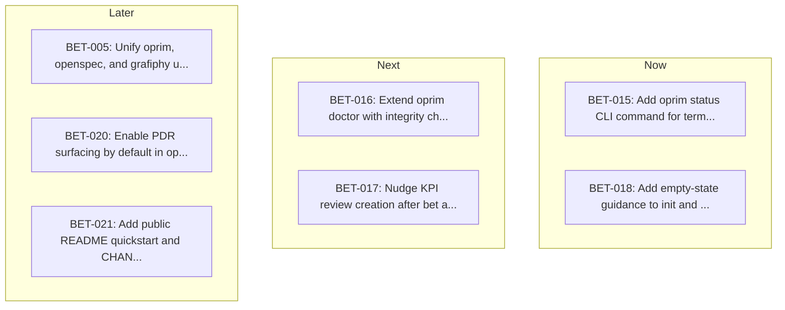

<!-- Auto-generated from oprim/sequence.yaml. Do not edit directly. -->
<!-- Regenerate by running: node oprim/scripts/generate-sequence-view.js -->

# Sequencing Board

### Backlog
- **BET-013**: Introduce atomic notes in oprim for lightweight thinking capture
- **BET-014**: Improve agent focus during bet discovery
- **BET-019**: Add quick-capture mode to bet creation to reduce idea abandonment
