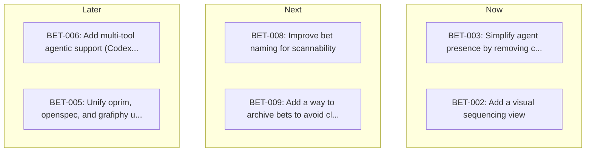

<!-- Auto-generated from oprim/sequence.yaml. Do not edit directly. -->
<!-- Regenerate by running /oprim:sequence. -->

# Sequencing Board

### Backlog
- **BET-007**: Surface relevant product decisions proactively during agent sessions
