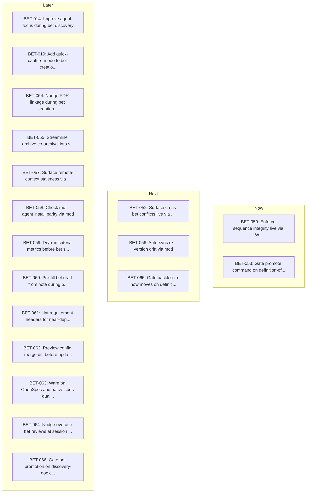

<!-- Auto-generated from oprim/sequence.yaml. Do not edit directly. -->
<!-- Regenerate by running: node oprim/scripts/generate-sequence-view.js -->

# Sequencing Board

```mermaid
graph TD
    subgraph Now
        BET050["BET-050: Enforce sequence integrity live via W..."]
        BET053["BET-053: Gate promote command on definition-of..."]
    end
    subgraph Next
        BET052["BET-052: Surface cross-bet conflicts live via ..."]
        BET056["BET-056: Auto-sync skill version drift via mod"]
        BET065["BET-065: Gate backlog-to-now moves on definiti..."]
    end
    subgraph Later
        BET014["BET-014: Improve agent focus during bet discovery"]
        BET019["BET-019: Add quick-capture mode to bet creatio..."]
        BET054["BET-054: Nudge PDR linkage during bet creation..."]
        BET055["BET-055: Streamline archive co-archival into s..."]
        BET057["BET-057: Surface remote-context staleness via ..."]
        BET058["BET-058: Check multi-agent install parity via mod"]
        BET059["BET-059: Dry-run criteria metrics before bet s..."]
        BET060["BET-060: Pre-fill bet draft from note during p..."]
        BET061["BET-061: Lint requirement headers for near-dup..."]
        BET062["BET-062: Preview config merge diff before upda..."]
        BET063["BET-063: Warn on OpenSpec and native spec dual..."]
        BET064["BET-064: Nudge overdue bet reviews at session ..."]
        BET066["BET-066: Gate bet promotion on discovery-doc c..."]
    end
```

### Backlog
- **BET-049**: Explore native dsh plugin for oprim workspace tools
- **BET-067**: Render sequence board as a dependency graph
- **BET-068**: Visualize bet lineage as a dependency graph
- **BET-069**: Visualize session changes as a blast-radius graph
- **BET-070**: Visualize cross-bet conflicts as a graph
- **BET-071**: Visualize multi-agent install parity as a graph
- **BET-072**: Visualize spec requirement dependencies as a graph
- **BET-073**: Visualize remote-context citations as a graph
