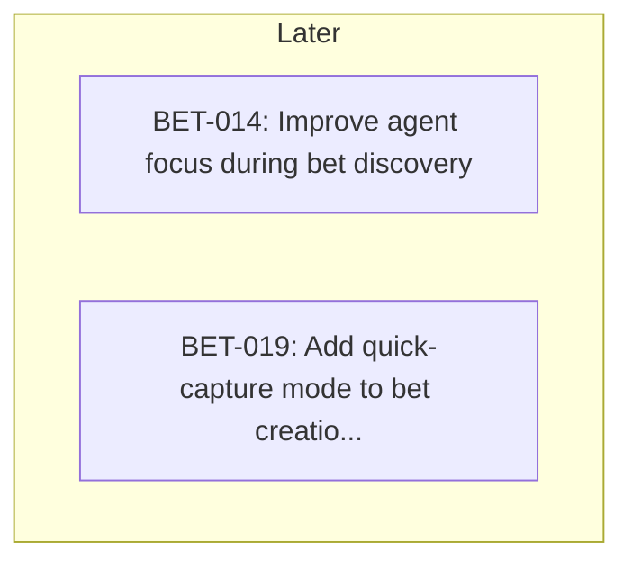

<!-- Auto-generated from oprim/sequence.yaml. Do not edit directly. -->
<!-- Regenerate by running: node oprim/scripts/generate-sequence-view.js -->

# Sequencing Board

```mermaid
graph TD
    subgraph Later
        BET014["BET-014: Improve agent focus during bet discovery"]
        BET019["BET-019: Add quick-capture mode to bet creatio..."]
    end
```

### Backlog
- **BET-049**: Explore native dsh plugin for oprim workspace tools
